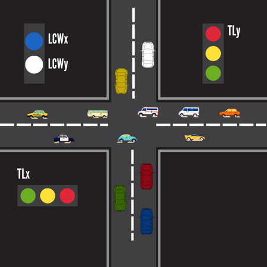

# Semaforo a dos vias 

Un ejemplo de un semaforo a dos vias, escrito en el lenguaje de programacion c++ para arduino nanoatmega328.

## Como lo hice?

Dividi los semaforos en dos maneras, el primer semaforo estara en el eje horizontal (X) y el segundo estara en el eje vertical (Y).



Con esta idea, dividi cada fase del semaforo:

  1. Primera fase:
      - LRx: 1 -> El LED rojo del semaforo X estara encendido.
      - LVy: 1 -> El LED verde del semaforo Y estara encendido.
      - Todos los demas LEDs estaran apagados.

  2. Segunda fase:
      - LRx: 1 -> El LED rojo del semaforo X estara encendido.
      - LYy: 1 -> El LED amarillo del semaforo Y estara encendido.
      - Todos los demas LEDs estaran apagados.

  3. Tercera fase:
      - LVx: 1 -> El LED verde del semaforo X estara encendido.
      - LRy: 1 -> El LED rojo del semaforo Y estara encendido.
      - Todos los demas LEDs estaran apagados. 

  4. Cuarta fase:
      - LYx: 1 -> El LED amarillo del semaforo X estara encendido.
      - LRy: 1 -> El LED rojo del semaforo Y estara encendido.
      - Todos los demas LEDs estaran apagados. 

Estas fases las almacene en un array de dos dimensiones, la primera es el numero de fases y la segunda es el numero de LEDs. 

```
const LED phases[rows][columns] = {
  {{LRx, 1}, {LYx, 0}, {LGx, 0}, {LRy, 0}, {LYy, 0}, {LGy, 1}},
  {{LRx, 1}, {LYx, 0}, {LGx, 0}, {LRy, 0}, {LYy, 1}, {LGy, 0}},
  {{LRx, 0}, {LYx, 0}, {LGx, 1}, {LRy, 1}, {LYy, 0}, {LGy, 0}},
  {{LRx, 0}, {LYx, 1}, {LGx, 0}, {LRy, 1}, {LYy, 0}, {LGy, 0}}
};
```

El tipo del array es una estructura de datos:

```
struct LED{
  const int pin; // Numero del pin que se encuentra el LED.
  const int state; // Estado del LED.
};
```

Declare dos variables de tipo booleano, crosswalk_x y crosswalk_y, estas variables inicializan con el valor false y cambian su estado cuando viene pedido el paso peatonal.

```
bool crosswalk_x = false; // Paso peatonal del semaforo x.
bool crosswalk_y = false; // Paso peatonal del semaforo y.

// Funcion que cambia el estadp de la variable crosswalk_x a true.
void change_state_crosswalk_x(){
	crosswalk_x = true;
}

// Funcion que cambia el estadp de la variable crosswalk_y a true.
void change_state_crosswalk_y(){
	crosswalk_y = true;
}

void setup(){
  // Declaramos cada pin que esta conectado a cada LED.
  for(int i = 4; i < 12; i++){
  	pinMode(i, OUTPUT);
  }
  pinMode(2, INPUT); // El pin 2 sera el boton del paso peatonal del semaforo X.
  pinMode(3, INPUT); // El pin 3 sera el boton del paso peatonal del semaforo Y.
  // Interferimos con el codigo cuando el boton viene pulsado y llamamos a la funcion conectada al boton.  
  attachInterrupt(digitalPinToInterrupt(2), change_state_crosswalk_x, RISING);
  attachInterrupt(digitalPinToInterrupt(3), change_state_crosswalk_y, RISING);
  Serial.begin(9600);
}
```


